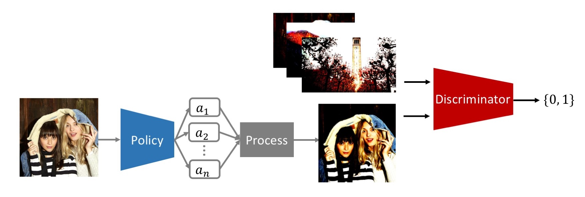
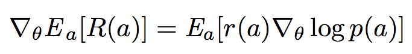
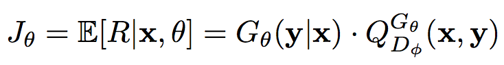
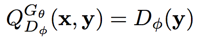
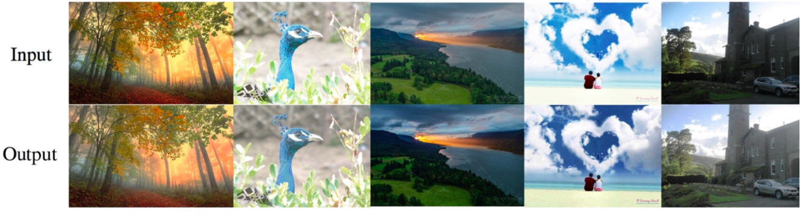
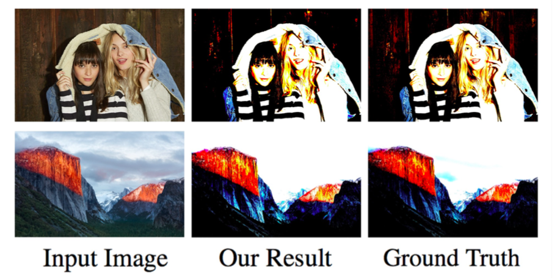

# Photo Optimizing Adversarial Net with Policy Gradient Method

Photo retouching is a time-consuming and challenging task that requires advanced skills beyond the abilities of casual photographers. This project aims to construct an agent which learns to edit photo in human-like fashion. Recently, theres has been lots of tasks enhance their robustness and performance via adversarial learning. We borrow the concept of **adversarial learning** into photo aesthetic improving task, and use the **policy gradient** to optimize the policy network whose action space is **human-like**.

 

## Requirement
- python 2.7
- scipy
- Tensorflow
- PIL


## Usage

We need two pools of images.
Our model will learn to edit photo from source pool to make it looks like the one in target pool.

```
pyhton main.py --source_path <path to source image> --target_path <path to target image> 
```


## Method
### Human Level Editing: Curve
The curves tool is perhaps the most powerful and flexible image transformation. The curves tool can take input tones and selectively stretch or compress them. Unlike levels however, which only has black, white and midpoint control, a tonal curve is controlled using any number of anchor points. The result of a given curve can be visualized by following a test input tone up to the curve, then over to its resulting output tone. A diagonal line through the center will therefore leave tones unchanged. In our experiments, we modify the coordinates (x and y) of N points on the curve, which correspond to policy’s actions ```a```.

### Policy Gradient
For each photo, we will pick several continuous actions ```a = {a1 , a2 ...an }```, which correspond to the points on curve mentioned in previous section. The model is a stochastic policy ```pi(a|x)``` where ```x``` is the input photo. Here we model curve adjusting as a continuous control task. Each action represent the ```μ``` value of a Gaussian distribution. In order to reduce action space, we fix sigma to a constant. While training, we will sample actions from the distribution. After acquiring actions, we will process the photo based on ```a```, which form a generative model ```G(y|x)``` where ```y``` is the output photo been processed with curve mentioned in the previous section. We directly maximize the reward ```R(a)```.

<p align="center"></p> 

### Discriminator for Adversarial Learning
our model acquire reward from a parameterized discriminative model ```D```  (Goodfellow and others 2014). ```D``` is a probability indicating how likely a photo is well optimized, in the other word, a masterpiece like photo. The discriminative model ```D```  is trained by providing positive examples S from high rating photo and the one generated by policy network.

### Adversarial training with policy gradient
The generator model (policy) ```G(y|x)``` is to generate a
photo ```y``` from the unprocessed one ```x``` so as to maximize its expected reward:

<p align="center"></p> 

where ```R``` is the reward for a photo. Note that the reward is from the discriminator ```D```. ```Q(x,y)``` is the action-value function of a photo, i.e. the expected reward starting from ```x```, taking action ```a```, and then following policy ```G```. Here we consider the estimated probability of being a masterpiece by the discriminator ```D(y)```· as the reward. Formally, we have:

<p align="center"></p> 

A benefit of using the discriminator ```D``` as a reward function is that it can be dynamically updated to further improve the generative model iteratively. It also serve as perceptual reward which means that we can grab training data from photos in the wild.

## Application
### Photo Optimizing



### Style Learning



## Citing
If you find this repository helpful please cite as 
```
@misc{Chuang2017,
  author = {Ching-Yao Chuang},
  title = {Photo Optimizing Adversarial Net with Policy Gradient Method},
  year = {2017},
  publisher = {GitHub},
  journal = {GitHub repository},
  howpublished = {\url{https://github.com/JamesChuanggg/photo-editing-tensorflow}},
  commit = {4bceb19d88dcb6d97e2dbb1fe6e59f84df5865ff}
}
```
